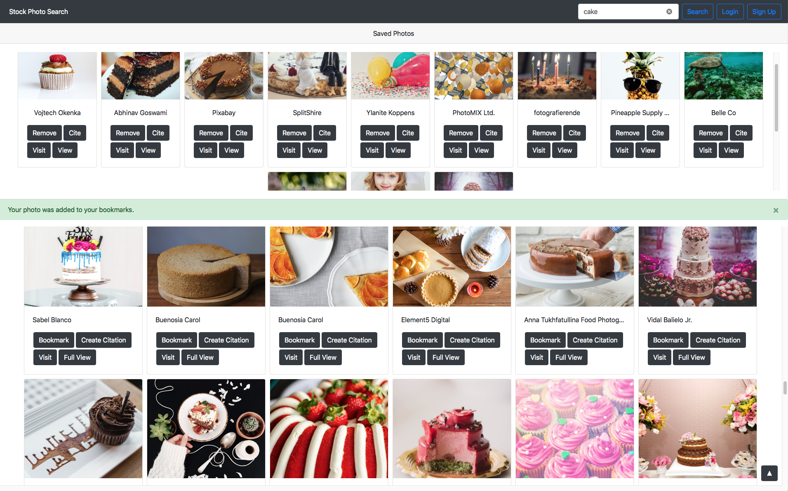

# StockPhotoSearch

Small practice project using JavaScript/Bootstrap CSS frontend and Node.js/Express backend. The original assignment was from Udacity's Front End Nanodegree Program, which asked students to create an asynchronous web app that uses Web API and user data to dynamically update the UI in a Weather Journal application. I diverged from and expanded upon the original prompt and created an application that works with the Pexels Stock Photo API.

    Features:
        - Users can search for stock photos. 
        - Users can bookmark their favorite photos, generate citations for crediting the photographers, preview photos, and remove photos from their list of saved photos.
        - Bookmarked photos will persist across user searches.
        - The server will save and retrieve user-bookmarked photos to/from Firebase, so that a user's photos are saved across sessions. This requires that the user login/register with the application.

    To fix: 
        - Only call Firebase when the user logs in, not on every single call. 
        - Don't show the sign up button for users who are currently logged in.
        - Add a button to log users out.
        - Can this support multiple users logging in?

To run:
    node server.js

